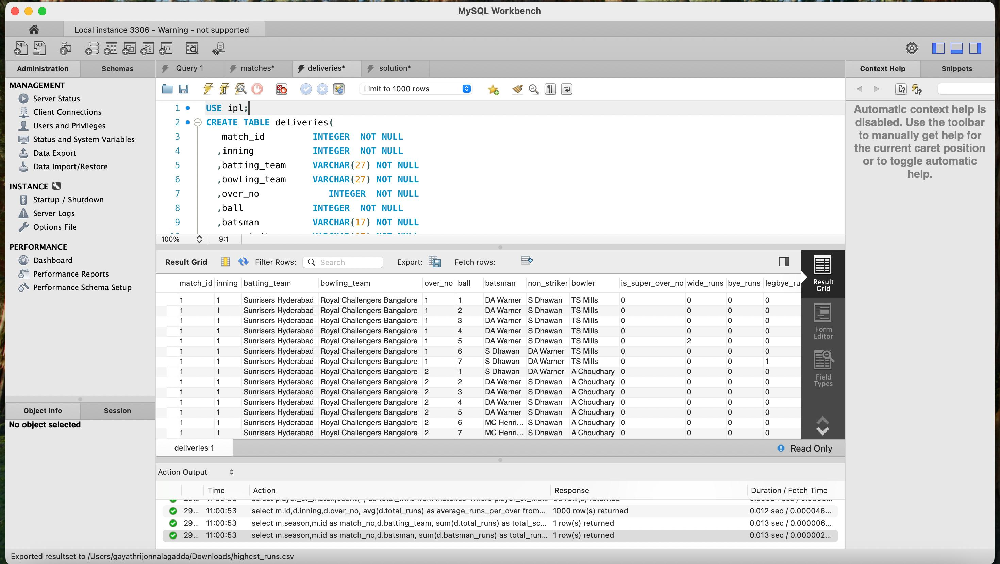
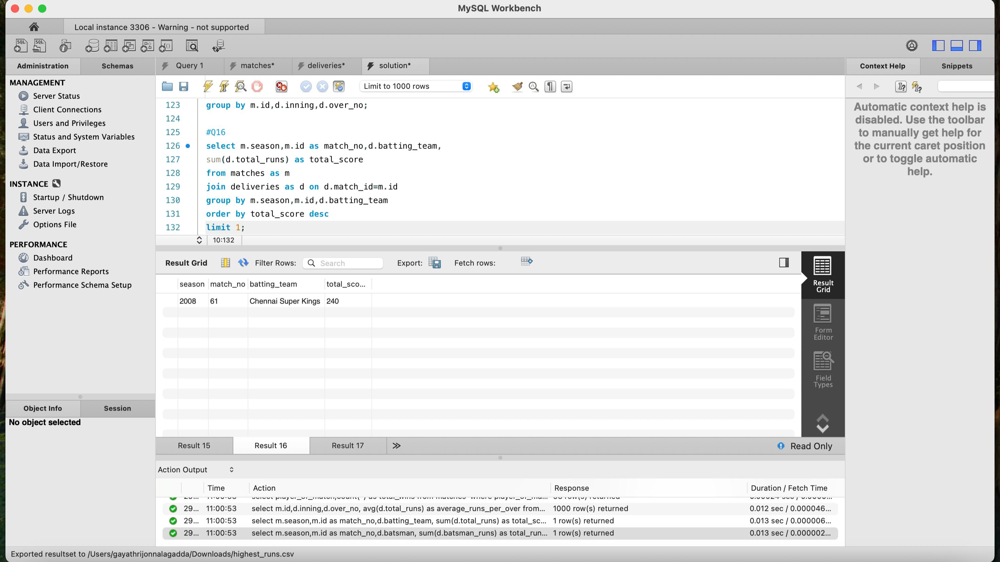

# IPL-Data-Analysis-using-MySQL
SQL-based IPL Data Analysis project using MySQL. The project performs data cleaning, database creation, analytical SQL queries, and generates insights from IPL match and ball-by-ball datasets.

## Overview

This project performs data analysis on the Indian Premier League (IPL) dataset using MySQL. The project involves importing match and ball-by-ball datasets into a MySQL database, writing SQL queries to extract useful insights, and exporting the query results into CSV files for analysis.

The project demonstrates SQL concepts such as joins, aggregation, grouping, ordering, filtering, subqueries, and analytical reporting.

---

## Dataset

The project uses two IPL datasets:

- matches.csv
- deliveries.csv

These datasets contain detailed information about IPL matches, players, teams, innings, and every ball delivered.

---

## Technologies Used

- MySQL
- MySQL Workbench
- SQL
- CSV Dataset

---

## Database Structure

The project consists of two primary tables:

### Matches

Contains:

- Match ID
- Season
- City
- Teams
- Toss details
- Winner
- Player of the Match
- Venue
- Result

### Deliveries

Contains:

- Match ID
- Innings
- Batting Team
- Bowling Team
- Over
- Ball
- Batsman
- Bowler
- Runs
- Extras
- Wickets
- Dismissal Information

---

## SQL Operations Performed

The project includes queries for:

- Total wins by each team
- Toss wins by each team
- Season winners
- Player of the Match statistics
- Highest individual score
- Highest team score
- Average runs scored per over
- Average strike rate of batsmen
- Batsman strike rate analysis
- Average boundaries scored by batsmen
- Team-wise average boundaries
- Highest batting partnership
- Bowlers with maximum wickets
- Bowling team extras
- Matches won while batting first

---

## Output Files

The following CSV files are generated after executing the SQL queries:

- highest_runs.csv
- highest_team_score.csv
- season_winner.csv
- player_of_match.csv
- team_no.of.wins.csv
- team_no.of.tosswins.csv
- battingteam_avgboundaries.csv
- battingteam_highestpartnership.csv
- batsman_avgboundaries.csv
- batsman_dismissals.csv
- batsman_sr.csv
- batting1st_matcheswon.csv
- avg_runs_perover.csv
- avg_strike_rate.csv
- bowler_morewickets.csv
- bowlingteam_extras.csv
- pom_totalwins.csv

---

## Project Files

### SQL Scripts

- matches.sql
- deliveries.sql
- solution.sql

### Dataset

- matches.csv
- deliveries.csv

---

## Implementation

The database was created using MySQL Workbench.

Tables were populated using the IPL datasets, and SQL queries were executed to generate analytical reports.

The generated reports were exported as CSV files.

---

## Screenshots

### MySQL Database Implementation

---

## Key Insights

Some of the analysis performed includes:

- Highest scoring batsman
- Highest team score
- Teams with maximum wins
- Toss win statistics
- Season champions
- Player of the Match winners
- Bowling performance
- Batting strike rates
- Average runs per over
- Boundary statistics

---

## What I Learned

- Creating relational databases in MySQL
- Importing CSV datasets into MySQL
- Writing SQL queries using joins
- Aggregate functions (SUM, COUNT, AVG, MAX)
- GROUP BY and ORDER BY
- Filtering records using WHERE and HAVING
- SQL subqueries
- Exporting query results to CSV
- Database design and normalization basics
- Performing sports data analytics using SQL

---

## Future Improvements

- Interactive dashboard using Power BI
- Data visualization using Python
- Stored procedures and views
- SQL indexing for performance optimization
- Integration with Tableau or Power BI

---

## Author

**Gayathri Wagdevi**

ECE Student

KL University
